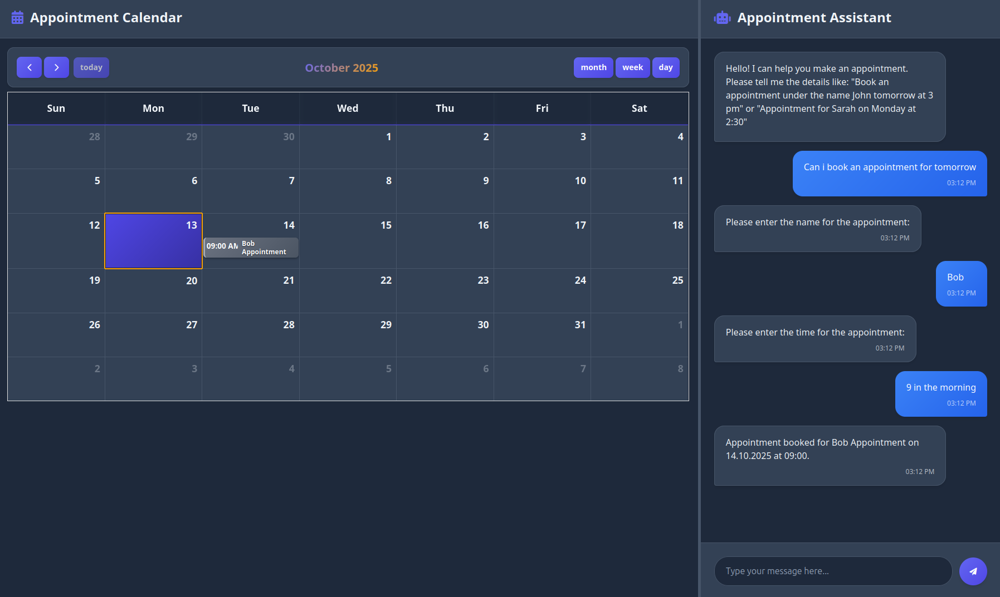

# 🗓️ Smart Scheduler AI — Conversational Appointment Scheduler

[](https://smart-scheduler-ai.onrender.com)
[](https://python.org)  
[](https://flask.palletsprojects.com)  
[](https://spacy.io)

A professional, dark-themed web application that demonstrates conversational NLP-driven scheduling. Users can create appointments via a chat interface; the backend extracts names, dates and times with spaCy and renders events on a FullCalendar UI.



---

---

## Features

- **🗣️ Natural-language Booking**: Parse user messages into appointment data.  
- **📅 FullCalendar Integration**: Display and manage events in an interactive UI.  
- **⚠️ Conflict Detection**: Automatically detect overlapping bookings.  
- **🧭 Robust Date/Time Handling**: Uses python-dateutil with multiple parsing fallbacks.  
- **💬 Conversational UX**: Progressive information requests when details are missing (name/date/time).  
- **🎨 Polished UI**: Dark theme, responsive layout, accessible components.
- **🧪 Unit-tested Backend** — Uses pytest and GitHub Actions for automated testing.
- **🔒 Secure Configuration** — Secrets stored in .env (ignored by Git).  
- **🚀 One-click Deployment** on Render — Automated build, model download, and startup.

---

---

## Technologies Used

- Backend: Python (3.11/3.12 recommended), Flask  
- NLP: spaCy (en_core_web_md)  
- Date/time parsing: python-dateutil  
- Frontend: HTML, CSS, Vanilla JavaScript, FullCalendar  
- Session handling: Flask-Session (session-backed reservations)  
- Testing: Pytest + GitHub Actions
- Deployment: Render via render.yaml

---

---

## Project Structure

```
smart-scheduler-ai/
├── app.py                          # Flask app + NLP parsing & routing
├── requirements.txt                # Python dependencies (see below)
├── render.yaml                     # Render deployment configuration
├── runtime.txt                     # Python runtime version (for Render)
├── .env                            # Secret keys
├── .gitignore                      # Files and folders ignored by git
├── templates/
│   └── index.html                  # Main UI template (calendar + chat)
├── static/
│   ├── style.css                   # UI styles (dark theme)
│   └── script.js                   # ReservationChatbot client-side class
├── tests/
│   ├── test_app_routes.py          # Flask routes test
│   └── test_reservation_logic.py   # Data parsing logic test
├── README.md                       # This file
└── LICENSE                         # MIT license 
```

---

---

## Quickstart (Local)

1. Create and activate a virtualenv:
```bash
python -m venv .venv
source .venv/bin/activate
```

2. Install dependencies:
```bash
pip install -r requirements.txt
```
If the spaCy model wheel from requirements fails, install the model manually:
```bash
python -m spacy download en_core_web_md
```

3. Run the app locally:
```bash
python app.py
```
Open http://127.0.0.1:5000

For production: run with Gunicorn
```bash
gunicorn --bind 0.0.0.0:8000 app:app
```

---

---

## Testing

# Run all tests for all logic, including NLP parsing, overlap detection, and Flask route
```bash
pytest
```

---

---

## Continuous Integration (CI)

### GitHub Actions automatically:

- **Installs dependencies**

- **Downloads the spaCy model**

- **Runs all unit tests**

- **Reports build status via badge**

### Workflow file: .github/workflows/python-app.yml   

---

---

## How it works — Key Flows

### Booking flow
1. User types a natural-language request (e.g., "Appointment for Sarah tomorrow at 3pm").  
2. The backend uses spaCy NLP + regex to extract details.
3. Missing fields trigger follow-up chatbot messages.
4. Once complete, the reservation object is stored in session and rendered on FullCalendar.  
5. Overlap detection prevents double-booking.

### Main code areas to review
- app.py — parsing logic (parse_reservation_text), overlap checking (check_overlap), endpoints (/process_reservation, /get_reservations)  
- static/script.js — frontend chatbot flow (ReservationChatbot), calendar event mapping  
- static/style.css — UI styling and responsive layout

---

---

## Technical highlights 

- SpaCy NLP combined with custom regex fallbacks for robust, real-world parsing.  
- Clear separation of concerns (backend parsing vs frontend UX).
- Session-based storage for quick demos; easy to upgrade to DB (SQLite/Postgres) for persistence.  
- Environment variables handled securely.
- Automated CI/CD pipeline for reliability.
- Deployable on Render in one click. 

---

---

## Future enhancements

- [ ] Database persistence (SQLite / Postgres)  
- [ ] Add timezone support and user-localized formatting  
- [ ] Custom spaCy components for improved date/time detection  
- [ ] User authentication and profiles 
- [ ] Dockerfile for containerized deployment 
- [ ] Export calendar to .ics and calendar invite emails

---

---

## License

This project is licensed under the MIT License — meaning you're free to use, modify, and distribute it with attribution.  
See [LICENSE](LICENSE) for full terms.

---

---

**Developed by Dimitar Karaskakovski**  
[GitHub Portfolio](https://github.com/dimitar-sudo)
